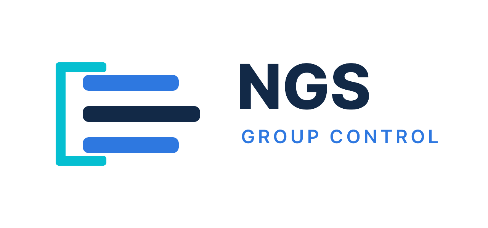

# NGS Group Control for After Effects



**タイムラインのレイヤーを、Group Nullひとつでまとめて操作。**

After Effects 2024以降のWindows / macOSで使えるScriptUI PanelとネイティブEffectです。無償で公開しており、AviUtlの「グループ制御」に近い操作感を目指しています。

[配布ファイル一覧](Release/) · [図解付きの詳細](README.html) · [利用許諾条件](LICENCE)

## 利用者向け

### できること

- Group Nullより下のレイヤーを、タイムライン順に指定数だけグループ化
- 既存の親子関係を活かしながら、Group Nullから位置・スケール・回転をまとめて操作
- Group Nullに追加した通常のAfter Effects Effectを、対象レイヤーへ順次同期
- `Ungroup`で、Group Controlが管理した親子関係とEffectコピーを解除

### インストール

PanelとネイティブEffectの両方が必要です。After Effectsを終了してからファイルを配置し、After Effectsを再起動してください。

配布ファイルは[Releaseフォルダ](Release/)にあります。

**Windows**

- `NGS_GroupControl.jsxbin`をAfter Effectsの`Support Files\Scripts\ScriptUI Panels\`へ配置
- `AEX\GroupControl.aex`を`Support Files\Plug-ins\NGS Group Control\`へ配置

**macOS**

- `NGS_GroupControl.jsxbin`をAfter Effectsの`Scripts/ScriptUI Panels/`へ配置
- `Plugin/GroupControl.plugin`を`Plug-ins/NGS Group Control/`へ配置
- After Effects 2024以外では、インストール先のバージョン名を読み替えてください

### 使い方

1. 作業するコンポジションで、まとめたいレイヤーを選択して`Create Group`を押します。
2. 作成されたGroup Nullの`Layer Count`で、対象にする数を調整します。
3. Group NullのTransformやEffectを使って、対象レイヤーをまとめて操作します。
4. グループを解除するときは、Group Nullを選んで`Ungroup`を押します。

Group Nullに追加したEffectを自動同期するには、Panelを開いた状態にしてください。操作の図解や導入の補足は[README.html](README.html)にあります。

### 制限事項

- Group NullのTransformにキーフレームがある場合、`Apply`できません。
- 既存の親子構造やExpressionを保つため、一部のレイヤーは対象からスキップされます。
- v1.0ではグループ全体の不透明度調整に対応していません。
- Group NullのAnchor Pointは自動調整されません。

### ライセンス

- 本ソフトを使った作品の個人利用・商用利用ができます。
- 本ソフト自体の有料販売は禁止されています。
- 再配布できるのは、受け取った版のプログラムコードを改変したものを、無償で、`LICENCE`を同梱して配布する場合に限られます。

詳細は[LICENCE](LICENCE)をご確認ください。

## 開発者向け

### リポジトリ構成

| パス | 内容 |
| --- | --- |
| `panel/` | ScriptUI Panel、ExtendScript、グループ処理とEffect同期 |
| `plugin/` | C++ネイティブEffectのWindows / macOS用プロジェクト |
| `tools/` | Panel用ソースのBundle作成とJSXBIN生成ツール |
| `tests/` | Nodeの回帰テストとAfter Effects用プローブ |
| `docs/` | 配布、ビルド、Effect同期の検証資料 |
| `Release/` | Windows / macOS向け配布ファイル |

### Panel用Bundleを作る

ルートディレクトリで次を実行すると、Panelのソースを1本のJSXへまとめます。

```powershell
node tools/build_group_control_panel_bundle.js
```

生成物は`build/distribution/NGS_GroupControl.jsx`です。JSXBINへの変換やWindows配布物のまとめ方は[配布手順](docs/installation.md)を参照してください。

### ビルドと検証

Nodeの回帰テストはPowerShellから次のコマンドで実行できます。

```powershell
node --test (Get-ChildItem -LiteralPath tests -Filter '*.test.js' -File | Select-Object -ExpandProperty FullName)
```

ネイティブEffectのビルドにはAfter Effects SDKが必要です。SDKはAdobeの条件に従って管理し、公開リポジトリや配布物へ含めないでください。WindowsのビルドとAE内の確認は[Effect同期の確認方法](docs/group-effect-validation.md)、macOSのビルド手順は[GitHub Actionsの説明](docs/github-macos-build.md)を参照してください。
